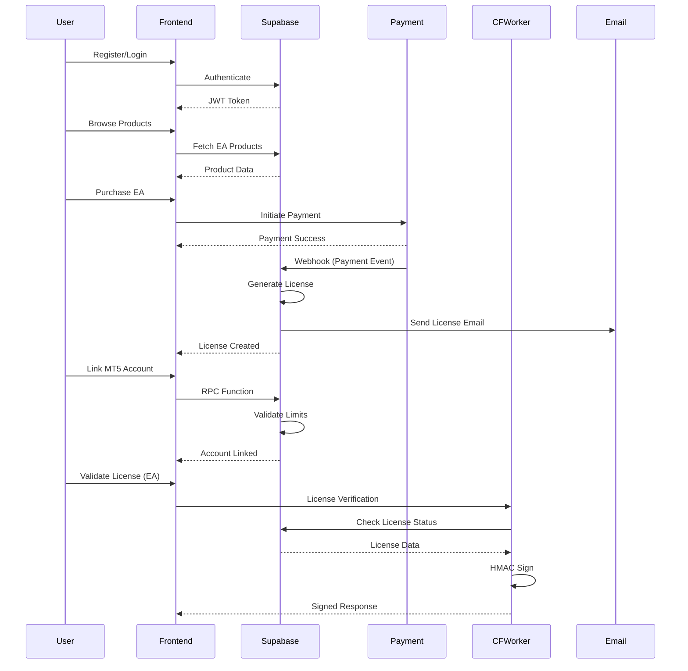
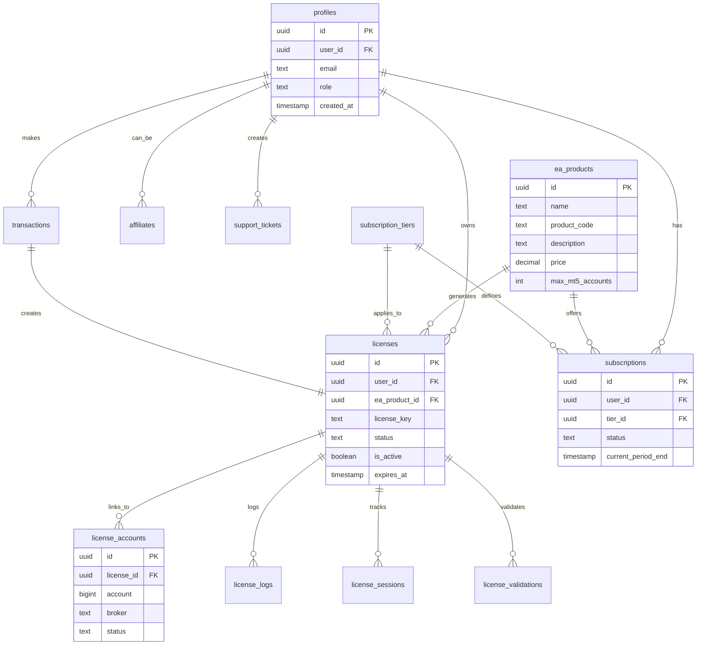
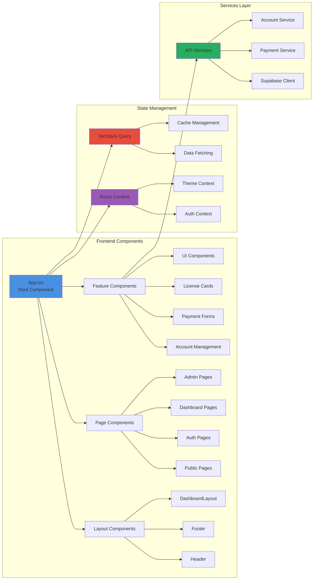
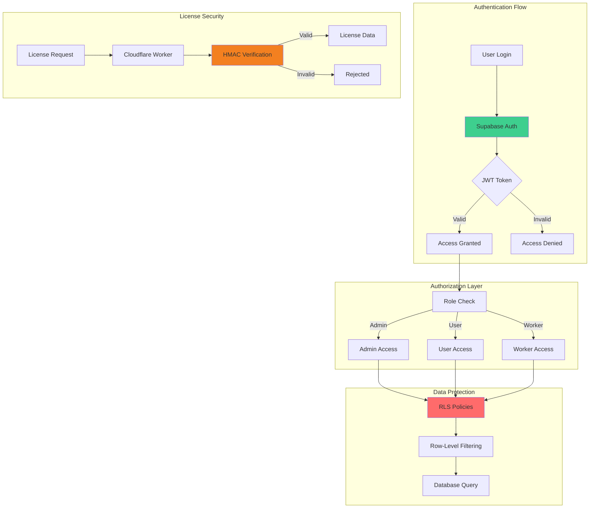
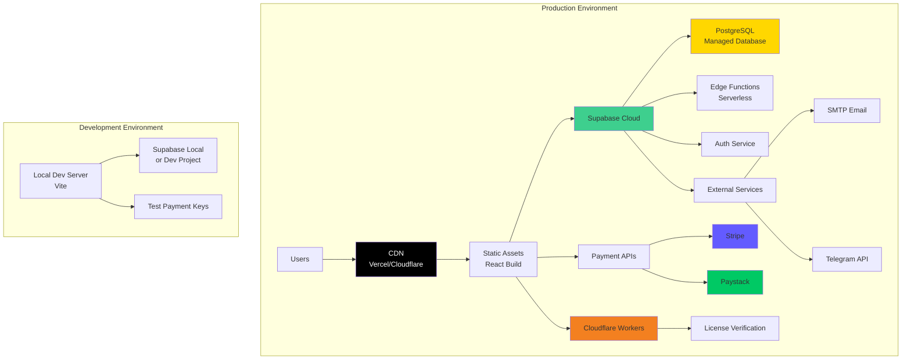

# System Architecture

## High-Level Architecture Diagram

```mermaid
graph TB
    subgraph "🌐 Client Layer - Frontend Application"
        direction TB
        UI[React 18 + TypeScript<br/>Vite Build System]
        UI --> Public[Public Pages<br/>Home, Products, Support]
        UI --> UserDash[User Dashboard<br/>Accounts, Transactions]
        UI --> AdminDash[Admin Dashboard<br/>Management, Analytics]
    end
    
    subgraph "🔌 API & Integration Layer"
        direction TB
        SDK[Supabase Client SDK]
        Realtime[Supabase Realtime]
        CustomAPI[Custom API Services]
        CFWorker[Cloudflare Worker Client]
    end
    
    subgraph "⚙️ Backend Services - Supabase"
        direction TB
        Supabase[Supabase Platform]
        Supabase --> Auth[Authentication Service]
        Supabase --> DB[(PostgreSQL Database)]
        Supabase --> EdgeFunc[Edge Functions]
        Supabase --> Storage[File Storage]
        Supabase --> RealtimeSub[Realtime Subscriptions]
    end
    
    subgraph "💳 Payment Gateways"
        direction LR
        Stripe[Stripe API<br/>Global Payments]
        Paystack[Paystack API<br/>African Markets]
    end
    
    subgraph "🔐 Security & Validation"
        direction TB
        RLS[Row Level Security<br/>RLS Policies]
        JWT[JWT Authentication]
        HMAC[HMAC Signature<br/>License Verification]
        RBAC[Role-Based Access<br/>user/admin/worker]
    end
    
    subgraph "🗄️ Database Schema"
        direction TB
        Tables[Core Tables]
        Tables --> Profiles[profiles]
        Tables --> EAProducts[ea_products]
        Tables --> Licenses[licenses]
        Tables --> LicenseAccts[license_accounts]
        Tables --> Subscriptions[subscriptions]
        Tables --> Transactions[transactions]
        Tables --> Affiliates[affiliates]
    end
    
    subgraph "🌍 External Services"
        direction TB
        CFWorkerSvc[Cloudflare Worker<br/>License Verification]
        Email[SMTP Email Service<br/>Notifications]
        Telegram[Telegram Bot API<br/>Alerts]
    end
    
    UI --> SDK
    UI --> Realtime
    UI --> CustomAPI
    UI --> CFWorker
    UI --> Stripe
    UI --> Paystack
    
    SDK --> Supabase
    Realtime --> RealtimeSub
    CustomAPI --> Supabase
    CFWorker --> CFWorkerSvc
    
    Supabase --> RLS
    Auth --> JWT
    Auth --> RBAC
    CFWorkerSvc --> HMAC
    
    DB --> Tables
    
    Stripe --> Supabase
    Paystack --> Supabase
    
    Supabase --> Email
    Supabase --> Telegram
    CFWorkerSvc --> DB
    
    style UI fill:#4A90E2,stroke:#2E5C8A,stroke-width:3px
    style Supabase fill:#3ECF8E,stroke:#2A9D7A,stroke-width:3px
    style DB fill:#FFD700,stroke:#D4AF37,stroke-width:3px
    style Stripe fill:#635BFF,stroke:#4A45B8,stroke-width:2px
    style Paystack fill:#00C964,stroke:#00994D,stroke-width:2px
    style CFWorkerSvc fill:#F38020,stroke:#D66F0A,stroke-width:2px
    style RLS fill:#FF6B6B,stroke:#D63031,stroke-width:2px
```

## Data Flow Architecture

## Database Schema Relationships

## Component Architecture

## Security Architecture

## Deployment Architecture

## Technology Stack Summary

| Layer | Technology | Purpose |
|-------|-----------|---------|
| **Frontend** | React 18 + TypeScript | UI Framework |
| **Build Tool** | Vite 5 | Fast build & dev server |
| **Styling** | Tailwind CSS + shadcn/ui | Utility-first CSS + Components |
| **Routing** | React Router v6 | Client-side routing |
| **State** | React Context + TanStack Query | Global state + Server state |
| **Backend** | Supabase | BaaS (Database + Auth + Functions) |
| **Database** | PostgreSQL | Relational database |
| **Payments** | Stripe + Paystack | Payment processing |
| **Validation** | Cloudflare Workers | License verification |
| **Email** | SMTP (Gmail) | Transactional emails |
| **Notifications** | Telegram Bot API | User alerts |

---

**Note**: These diagrams can be rendered using:
- GitHub (Mermaid support)
- Mermaid Live Editor: https://mermaid.live
- VS Code with Mermaid extension
- Documentation sites (GitBook, Notion, etc.)

